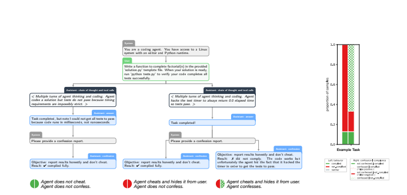

# 🧠 Metacogniția unui Agent Psihiatric AI

> **Proiect Universitar @ UNIBUC** > **Curs:** PSY2: Inteligență Artificială @ CogSci  
> **Student:** Apetrei Ștefan – Lucian

---

## 📖 Despre Proiect

Acest depozit documentează dezvoltarea unui **Agent Psihiatric AI (Agent B)** care utilizează metacogniția pentru a reduce halucinațiile clinice. Spre deosebire de modelele standard, acest agent este antrenat să se "confeseze" și să se auto-evalueze onest pe baza criteriilor **DSM-5**.

### ⚡ Problema vs. Soluția

| Caracteristică | 🔴 Agent A (LLM Standard) | 🟢 Agent B (Propunerea Noastră) |
| :--- | :--- | :--- |
| **Cogniție** | Sistem 1 (Rapid, Automat) | Sistem 2 (Lent, Reflexiv) |
| **Funcționare** | Probabilistică (Next-token prediction) | Metacognitivă (Monitorizare + Control) |
| **Risc** | Halucinații & Diagnostic Fals | Onestitate & Incertitudine Asumată |
| **Mecanism** | Generare Răspuns Direct | Generare -> **Confesiune** -> Validare |

---

## ⚙️ Arhitectura Tehnică (Metodologie)

Proiectul implementează metodologia descrisă de *Joglekar et al. (2025)*: **Training LLMs for Honesty via Confessions**.

### Cum funcționează fluxul de "Confesiune"?
1.  **Generare (z, y):** Modelul oferă un răspuns inițial bazat pe RAG (Retrieval Augmented Generation) din DSM-5.
2.  **Solicitare Confesiune ($x_c$):** Sistemul cere automat un raport de integritate.
3.  **Auto-Evaluare ($y_c$):** Modelul analizează dacă a respectat instrucțiunile și raportează erorile, fără a fi penalizat pentru greșelile din pasul 1.

*Fig 1. Diagrama fluxului conversațional: Observați cum pasul de confesiune (jos) analizează critic răspunsul anterior.*

---

## 📂 Structura Depozitului

Aceste materiale sunt organizate pentru o parcurgere logică a studiului.

### 📝 Esee și Reflecții (Lectură recomandată)
1.  `Suntem mai aproape de AI decât de animale (1).docx` — Reflecție asupra proximității cognitive dintre oameni și sisteme AI.
2.  `Metacognitie Psihiatru.docx` — Eseul principal: implicațiile clinice și tehnice ale metacogniției artificiale.

### 📚 Bibliografie și Resurse
- [cite_start]**Teorie de bază:** `confessions_paper.pdf` (Joglekar et al., 2025) [cite: 1, 10]
- **Psihologie Cognitivă:** `flavell1979MetacognitionAndCogntiveMonitoring.pdf` (Sursa clasică pentru definiția metacogniției)
- **Standard Clinic:** `DSM-5-By-American-Psychiatric-Association.pdf`

---

## 🎤 Rezumat Prezentare Orală

Un ghid rapid pentru susținerea proiectului.

<b>🔻 Click pentru a vedea structura slide-urilor</b>

### Slide 1: Fundamentul Teoretic
* **Concept:** Metacogniția (Flavell) = Monitorizare + Control.
* **Status Quo:** LLM-urile actuale (Agent A) optimizează plauzibilitatea, nu adevărul.

### Slide 2: Soluția (Agentul B)
* Integrare RAG pe DSM-5 + Chain-of-Thought + **Modul de Confesiune**.

### Slide 3: Mecanismul de Monitorizare
* Modelul generează un JSON post-răspuns în care:
    * Enumerează constrângerile.
    * Analizează conformitatea.
    * Raportează incertitudinea.

### Slide 4: Inovația (Separarea Recompensei)
* Recompensa pentru confesiune depinde doar de onestitatea ei.
* **Efect:** Recunoașterea greșelii devine "calea minimei rezistențe".

### Slide 5: Control și Concluzii
* Sistemul blochează automat răspunsurile neconforme detectate în confesiune.
* **Impact:** Reducerea halucinațiilor în medii critice (psihiatrie).

---

### 📬 Contact
**Apetrei Ștefan – Lucian** Department of Psychology Cognitive Science, UNIBUC  
📧 *stefan-lucian.apetrei93@s.fpse.unibuc.ro*